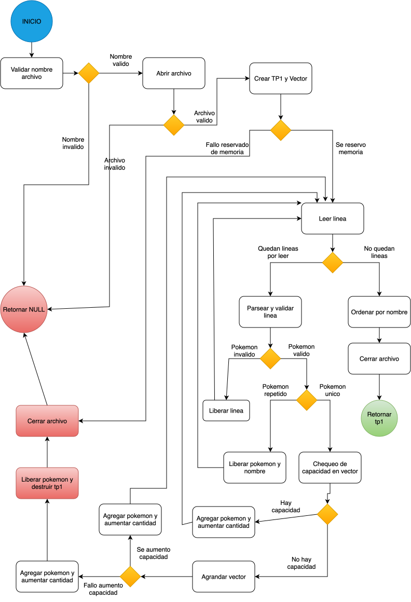
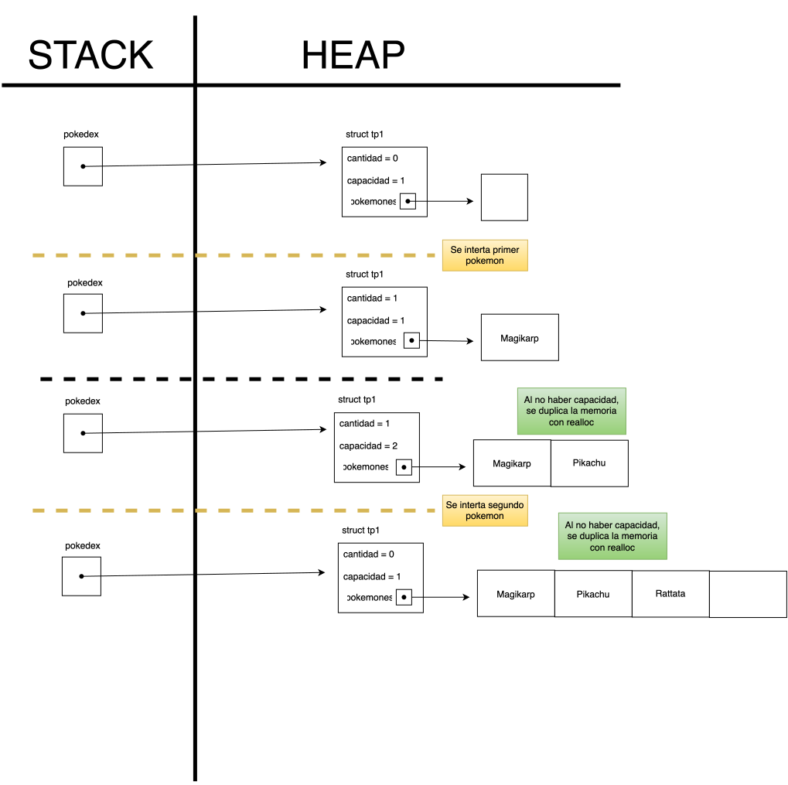
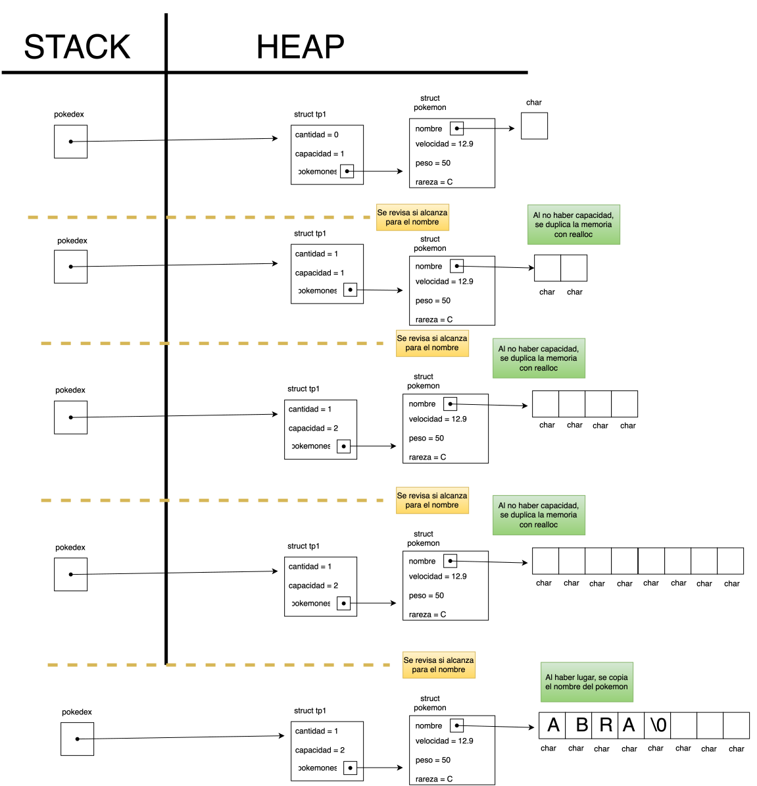

<div align="right">
    
</div>

# TP1 

## Información del estudiante

* Romano Juan Pablo
* 96.508
* jpromano@fi.uba.ar

---


## Índice
* [1. Instrucciones](#1-Instrucciones)
  * [1.1. Compilar el proyecto](#11-Compilar-el-proyecto)
  * [1.2. Ejecutar las pruebas](#12-Ejecutar-las-pruebas)
  * [1.3. Ejecutar el programa con Valgrind](#13-Ejecutar-el-programa-con-Valgrind)
* [2. Funcionamiento](#2-Funcionamiento)
* [3. Estructura](#3-Estructura)
  * [3.1. Diagrama de memoria](#31-Diagrama-de-memoria)
  * [3.2. Análisis de complejidades](#32-Análisis-de-complejidades)
* [4. Decisiones de diseño y/o complejidades de implementación](#4-Decisiones-de-diseño-yo-complejidades-de-implementación)
* [5. Respuestas a las preguntas teóricas](#5-Respuestas-a-las-preguntas-teóricas)

## 1. Instrucciones

> [!TIP]
> Se recomienda usar un Makefile y colocar en esta sección los comandos Make.

### 1.1. Compilar el proyecto para usar comandos
```bash
gcc -Wall -Wextra -Werror -std=c99 main.c src/comandos.c src/tp1.c src/leer_linea.c -o tp1
```

Ejemplo de ejecucion de un comando. Mostrar un pokemon al azar:
```bash
./tp1 archivos_prueba/prueba_normal.csv mostrar-uno
```

### 1.2. Compilar y ejecutar las pruebas
Compilar:
```bash
gcc -Wall -Wextra -Werror -std=c99 pruebas/pruebas_alumno.c src/tp1.c src/leer_linea.c -o pruebas_alumno
```
Ejecutar:
```bash
./pruebas_alumno
```

### 1.3. Ejecutar el programa con Valgrind
```bash
valgrind --track-origin=yes --leak-check=full ./tp1 archivos_prueba/prueba_normal.csv
```

## 2. Funcionamiento

El programa recibe un archivo csv con registros de distintos pokemons, procesa uno a uno los registros. En caso de que los registros sean validos, los guarda en el heap en estructuras debidamente asignadas que crecen dinamicamente partiendo de una capacidad inicial 1, luego 2, luego 4, y asi sucesivamente. Al finalizar la lectura de registros, le solicita al usuario el nombre del archivo que quiere procesar, un comando elegido entre 4 posibilidades, y ademas, en el caso del comando `buscar-nombre`, recibe un tercer parametro que es el nombre del pokemon. Luego procesa los parametros y devuelve por pantalla todos los registros, cumpliendo con cada una de las consignas para los comandos del enunciado, y en el caso de `buscar-nombre`, devuelve el pokemon pedido y sus datos por pantalla.
<div align="center">
  
  <p>Diagrama de flujo del programa explicado con más detalle.</p>
</div>

## 3. Estructura
Para la implementacion de la estructura tp1, decidi que me resultaria conveniente tener la capacidad de la pokedex para asi ir incrementandola dinamicamente a medida que fuera necesario, la cantidad de pokemons unicos que se iban registrando, para asi agrandar la capacidad si ambas coincidian, y por ultimo, un puntero a un vector de `struct pokemon`, donde se almacenan individualmente todos los pokemons.

### 3.1. Diagrama de memoria
<div align="center">
  
  <p>Diagrama de memoria de la estructura.</p>
</div>

<div align="center">
  
  <p>Diagrama de memoria del nombre de los pokemons.</p>
</div>


### 3.2. Análisis de complejidades
| Función | Complejidad | Justificación |
|---|---:|---|
| `tp1_leer_archivo` | O(n^2) | Lee y parsea el archivo, donde en el peor caso, cada linea tien n cantidad total de caracteres. Además, cada pokemon válido se agrega realizando una búsqueda lineal de duplicados y, al finalizar, se ordenan los pokemon mediante el algoritmo de ordenamiento de selección que tiene una complejidad Big-O de O(n^2),dando asi que la complejidad de leer_archivo sera de O(n^2) por ser la peor complejidad dentro de la funcion.|
| `tp1_cantidad` | O(1) | Devuelve directamente el campo `cantidad_pokemons` de la estructura, sin realizar recorridos. |
| `tp1_destruir` | O(n) | Recorre los \(n\) pokemon para liberar el nombre de cada uno. Despues libera el vector y la estructura principal. |
| `tp1_buscar_pokemon` | O(n) | En el peor caso recorre los \(n\) pokemon. Por cada uno compara un nombre que puede tener hasta \(m\) caracteres mediante `strcasecmp`. Si la longitud de los nombres mucho menor a la cantidad de pokemons, se simplifica a O(n). |
| `tp1_buscar_orden` | O(1) | Valida el indice y accede directamente a una posición del vector. |
| `tp1_combinar` | O(n^2) | En el peor de los casos, ambos archivos podran tener n y m cantidades de pokemon, en cuyo caso podriamos simplificar el analisis considerando n para ambos archivos. Para cada inserción busca duplicados linealmente. Por ultimo, los pokemons se ordenan mediante selección. Dicho esto, nuevamente podemos simplificar con la mayor complejidad siendo la del ordenamiento, dando asi una complejidad de O(n^2). |
| `tp1_iterar` | O(n) | En el peor caso recorre los \(n\) pokemon y ejecuta la función `f` sobre cada uno. Siempre y cuando `f` no tenga complejidad mayor a \(O(n)\), la complejidad de tp1_iterar sera O(n). Caso contrario, la complejidad de tp1_iterar, dependera de la complejidad de `f`. |
| `tp1_guardar_archivo` | O(n) | Recorre los \(n\) pokemon y escribe los datos de cada uno. El costo de cada escritura depende de la longitud del nombre. con nombres mucho menores en caracteres mucho menor a la cantidad de pokemons, se simplifica a O(n). |

## 4. Decisiones de diseño y/o complejidades de implementación 
La mayor complejidad estuvo en manejar correctamente la memoria dinamica tanto para la lacutra de las lineas, como para el reservado de memoria para cada de cada pokemon. Tambien, fue importante definir correctamente como se manejaba la memoria para evitar perdidas de memoria al descartar pokemons duplicados o al operar con los archivos. En cuanto al diseño, me parecio que lo mas logico era intentar modularizar las funciones lo mejor posible, y separarlas segun si eran de lectura, si eran para procesar los registros, o si servian como comandos por terminal. Por ultimo, al no poder usar qsort, tuve que implementar selection sort para ordenar alfabeticamente los pokemons.

## 5. Respuestas a las preguntas teóricas
 - Dar una definición de complejidad computacional y explique cómo se calcula.

La complejidad computacional es una forma de estudiar como crecen el tiempo de ejecucion y la memoria utilizada por un algoritmo segun un tamaño de entrada. Para calcularlos, se cuentan las instrucciones ejecutadas y estrucutas necesarias, y utilizando la notacion Big-O para determinar la complejidad de dicho algoritmo.
 
 - Explique qué dificultades tuvo para implementar las funcionalidades pedidas en el main (si tuvo alguna) y explique si alguna de estas dificultades se podría haber evitado modificando la definición del .h

 La principal dificultad que tuve fue en como acceder a los pokemons sin conocer la estructura interna de tp1_t, al ser de caja opaca. Lo pude resolver usando tp1_iterar, tp1_buscar_pokemon y tp1_buscar_orden. Tal vez se podria haber simplificado un poco si el .h tenia definida una funcion para convertir las rarezas a letra directamente.